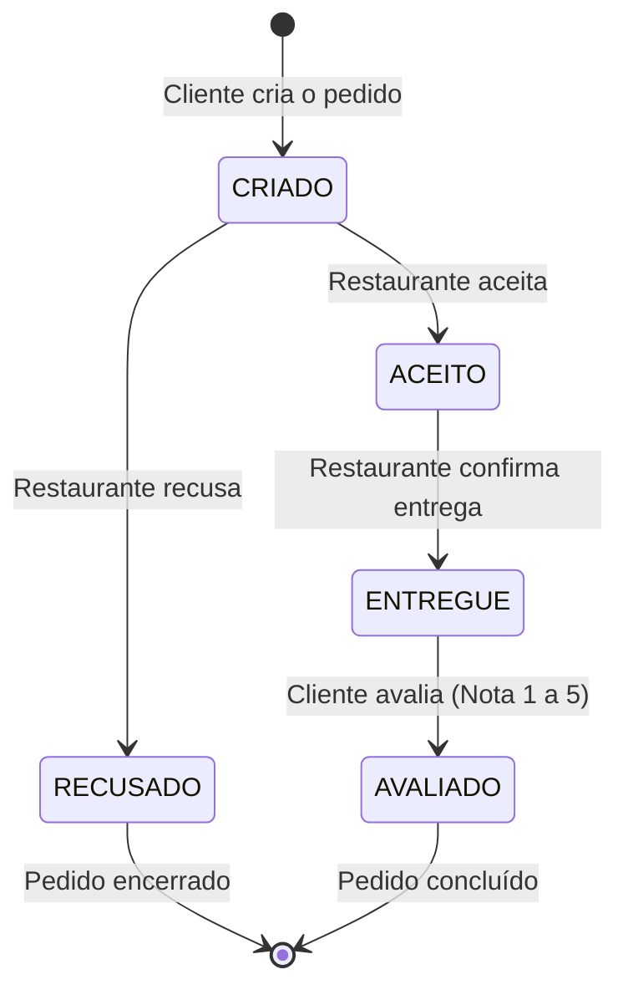
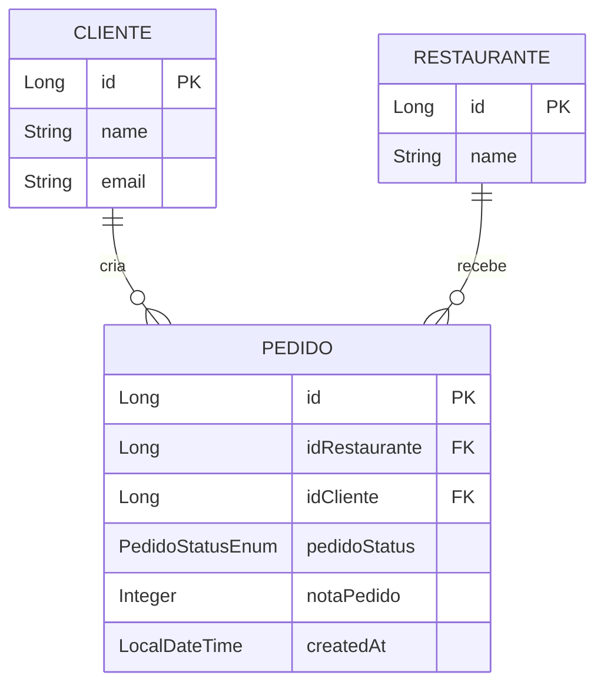

# Desenho da Solução e Arquitetura - Aplicação de Food Delivery

## 1. Visão Geral da Solução

A aplicação de **Food Delivery** é uma API REST desenvolvida com o ecossistema Java/Spring Boot e banco de dados relacional PostgreSQL. O objetivo principal da solução é garantir o controle de estados dos pedidos.

---

## 2. Tecnologias Utilizadas e Justificativa

| Tecnologia | Função na Aplicação | Justificativa da Escolha |
| :--- | :--- | :--- |
| **Java 17 (LTS)** | Linguagem de Programação | Versão LTS moderna com performance otimizada, recursos como Records e Pattern Matching, além de suporte de longo prazo. |
| **Spring Boot 3.x** | Framework Backend | Produtividade no desenvolvimento de APIs RESTful, gerenciamento simplificado de dependências (Starters) e infraestrutura robusta. |
| **Spring Data JPA / Hibernate** | ORM e Mapeamento de Dados | Abstração de queries SQL e gerenciamento do ciclo de vida das entidades JPA com persistência simplificada. |
| **PostgreSQL 15** | Banco de Dados Relacional | Sistema de gerenciamento de banco de dados robusto, ACID-compliant, altamente confiável para dados estruturados. |
| **Docker & Docker Compose** | Conteinerização e Orquestração | Permite subir a aplicação e o banco de dados em qualquer ambiente com um único comando (`docker-compose up`), garantindo reprodutibilidade. |
| **Springdoc OpenAPI (Swagger)** | Documentação de APIs | Interface interativa `/swagger-ui.html` gerada automaticamente para testes rápidos dos contratos e endpoints da aplicação. |

---

## 3. Arquitetura e Fluxo de Status do Pedido

A aplicação adota um padrão de arquitetura alinhado ao **Domain-Driven Design (DDD) Tático / Rich Domain Model**, onde a própria entidade `Pedido` é responsável por validar e executar as transições de seu ciclo de vida.

### Diagrama de Estados do Pedido (State Diagram)

### Regras do Fluxo:
1. **`CRIADO` → `ACEITO` ou `RECUSADO`**: Apenas o restaurante **destino** do pedido (`idRestaurante`) pode realizar a transição.
2. **`ACEITO` → `ENTREGUE`**: Apenas pedidos previamente aceitos podem ser marcados como entregues pelo restaurante dono do pedido. Pedidos recusados ou criados não podem transitar diretamente para entregue.
3. **`ENTREGUE` → `AVALIADO`**: Apenas o cliente **criador** do pedido (`idCliente`) pode avaliar um pedido que esteja obrigatoriamente no status `ENTREGUE`. A nota deve ser um valor inteiro entre 1 e 5.

---

## 4. Modelagem de Entidades e Relacionamentos (ERD)

